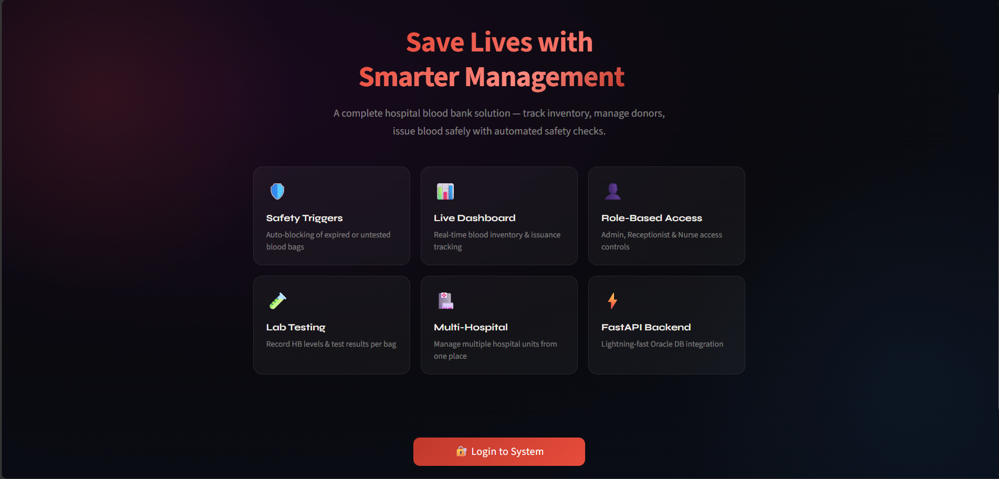
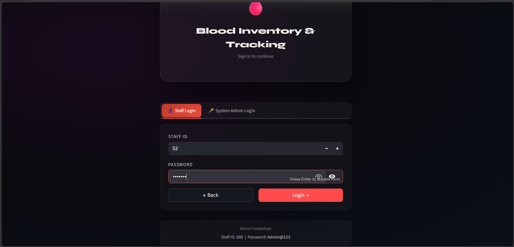
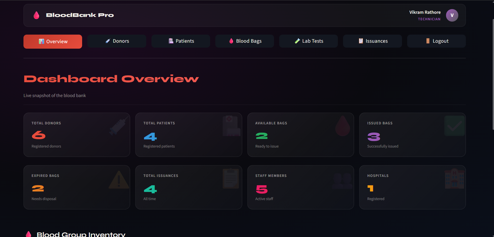
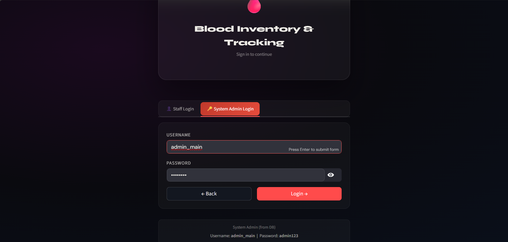
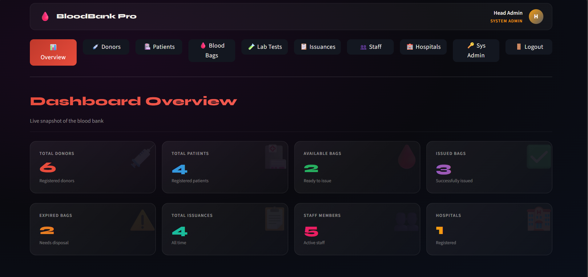
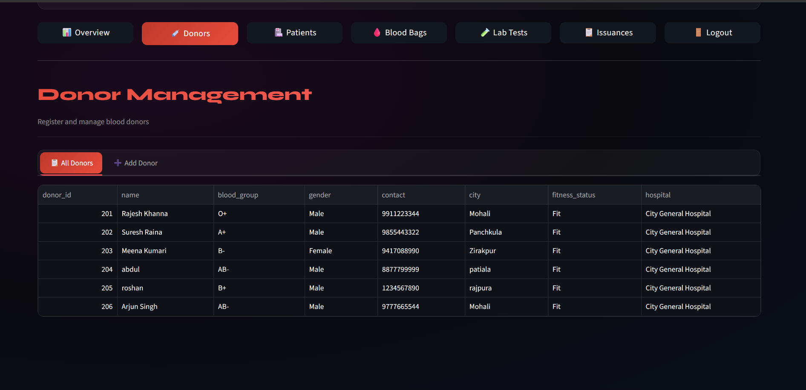
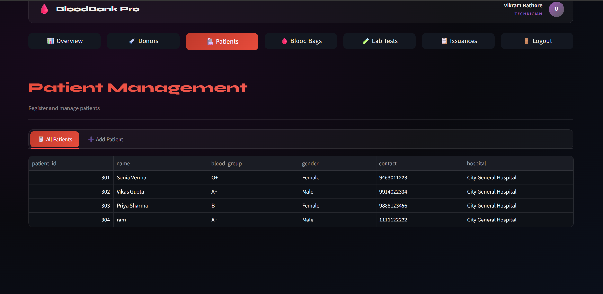

# 🩸 Blood Inventory & Tracking System

A web-based **Blood Inventory & Tracking System** designed to manage key blood-bank operations including donors, patients, blood bags, laboratory testing, blood issuance, staff, and hospitals.

The system is built using **Python, Streamlit, FastAPI, and Oracle Database**, with role-based access control and database-level validation using **PL/SQL triggers**.

## ✨ Features

- 🩸 Blood inventory and blood bag management
- 👤 Donor registration and management
- 🏥 Patient registration and management
- 🧪 Laboratory test management
- 📋 Blood issuance management
- 👥 Staff management
- 🏥 Hospital management
- 🔐 Role-based authentication and access control
- 📊 Dashboard for monitoring blood-bank operations
- ⚡ FastAPI backend
- 🗄️ Oracle Database integration
- 🔥 PL/SQL triggers for database-level validation

## 👥 User Roles

### 👤 Staff

Staff users have access to the operational modules required for daily blood-bank activities, including:

- Donors
- Patients
- Blood Bags
- Laboratory Tests
- Issuances

### 🔑 System Admin

The System Admin has higher-level administrative access and can manage:

- Staff members
- Hospitals
- System administration
- Operational modules

The role-based structure helps restrict sensitive administrative operations to authorized users.

## 🛠️ Technology Stack

| Technology | Purpose |
|---|---|
| Python | Application development |
| Streamlit | Frontend and user interface |
| FastAPI | Backend API |
| Oracle Database | Database management |
| PL/SQL | Database logic and triggers |
| Requests | API communication |
| Pandas | Data handling |
| python-dotenv | Environment configuration |
| Uvicorn | FastAPI server |

## 📁 Project Structure

| File | Purpose |
|---|---|
| `app.py` | Streamlit frontend and application interface |
| `main.py` | FastAPI backend |
| `auth.py` | Authentication and login functionality |
| `db_config.py` | Oracle database connection configuration |
| `requirements.txt` | Python project dependencies |
| `.gitignore` | Prevents sensitive and local files from being committed |
| `.env` | Local database and environment configuration |

> **Note:** `.env` is used locally and is intentionally excluded from the Git repository.

## ⚙️ Installation

### 1. Clone the Repository

```bash
git clone https://github.com/Vansh0036/Blood-inventory-and-tracking-system.git
cd Blood-inventory-and-tracking-system
```

### 2. Create a Virtual Environment

```bash
python -m venv venv
```

### 3. Activate the Virtual Environment

**Windows:**

```bash
venv\Scripts\activate
```

### 4. Install Dependencies

```bash
pip install -r requirements.txt
```

## 🔐 Environment Configuration

Create a `.env` file in the project directory and configure your Oracle database connection.

Example:

```env
ORACLE_USER=your_username
ORACLE_PASSWORD=your_password
ORACLE_DSN=your_database_dsn
```

**Do not commit real database credentials to GitHub.**

## ▶️ Running the Application

The application consists of a **FastAPI backend** and a **Streamlit frontend**.

### Start the FastAPI Backend

Open a terminal and run:

```bash
uvicorn main:app --reload --port 8000
```

### Start the Streamlit Frontend

Open another terminal and run:

```bash
streamlit run app.py
```

The application will open in your browser.

## 🖥️ Application Modules

The system provides separate views/modules for:

1. Login
2. Dashboard Overview
3. Donor Management
4. Patient Management
5. Blood Bag Management
6. Laboratory Tests
7. Blood Issuances
8. Staff Management
9. Hospital Management
10. System Administration

## 🖼️ Application Screenshots

### 🏠 Home Page



### 🔐 Staff Login



### 👤 Staff Dashboard



### 🔑 System Admin Login



### 📊 Admin Dashboard



### 🩸 Donor Management



### 🏥 Patient Management



## 🗄️ Database

The application uses **Oracle Database** as the backend database.

Database functionality includes:

- Relational data management
- SQL queries
- PL/SQL logic
- Database-level validation
- Triggers for enforcing business rules

## 🔒 Security

- Database credentials are stored using environment variables.
- `.env` is excluded from version control.
- Role-based access restricts administrative functionality.
- Database-level validation is implemented using PL/SQL triggers.
- Different user roles have different access levels.

## 🎯 Project Objective

The objective of this project is to provide a centralized system for managing blood-bank operations while improving:

- Blood inventory tracking
- Donor and patient management
- Blood issuance monitoring
- Data integrity
- Role-based access
- Administrative control

## 👨‍💻 Author

**Vansh**

GitHub: [Vansh0036](https://github.com/Vansh0036)
